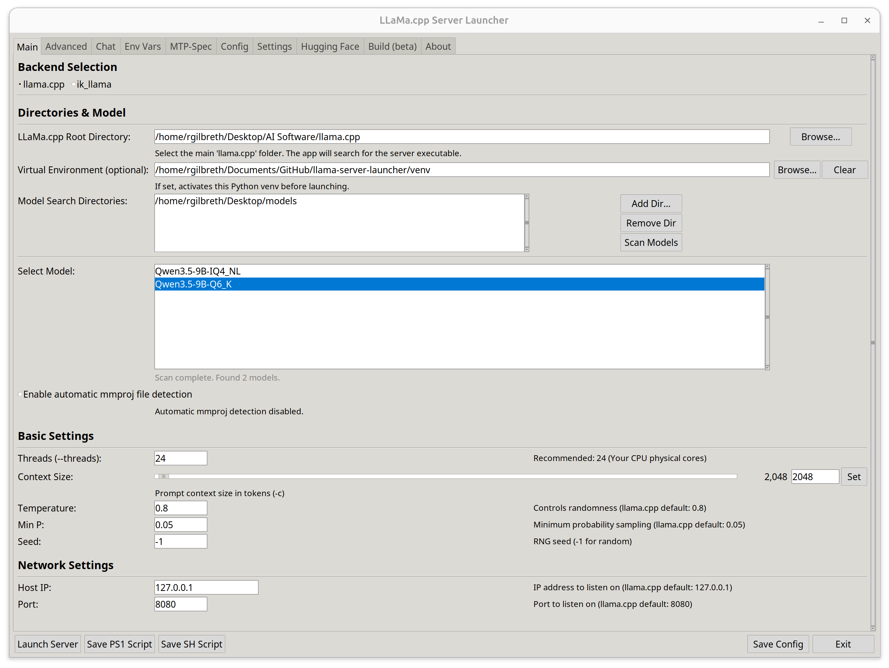
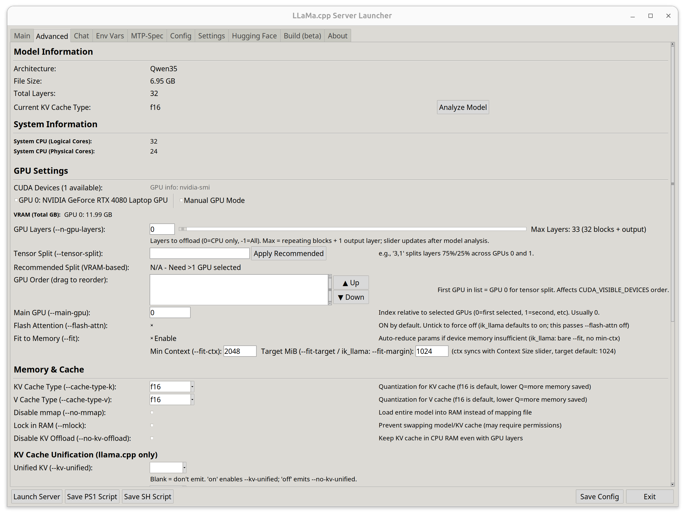
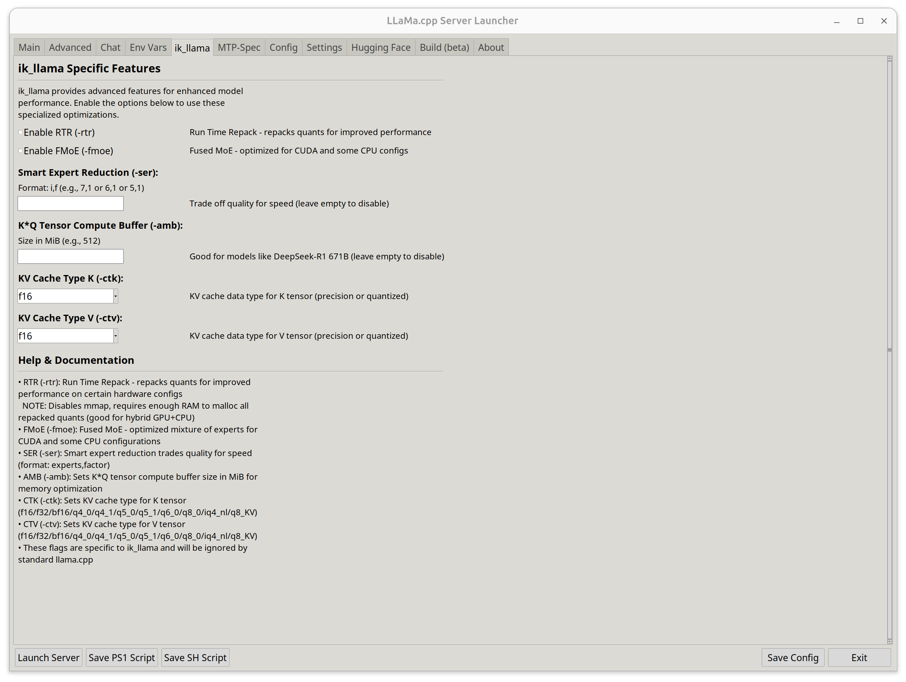
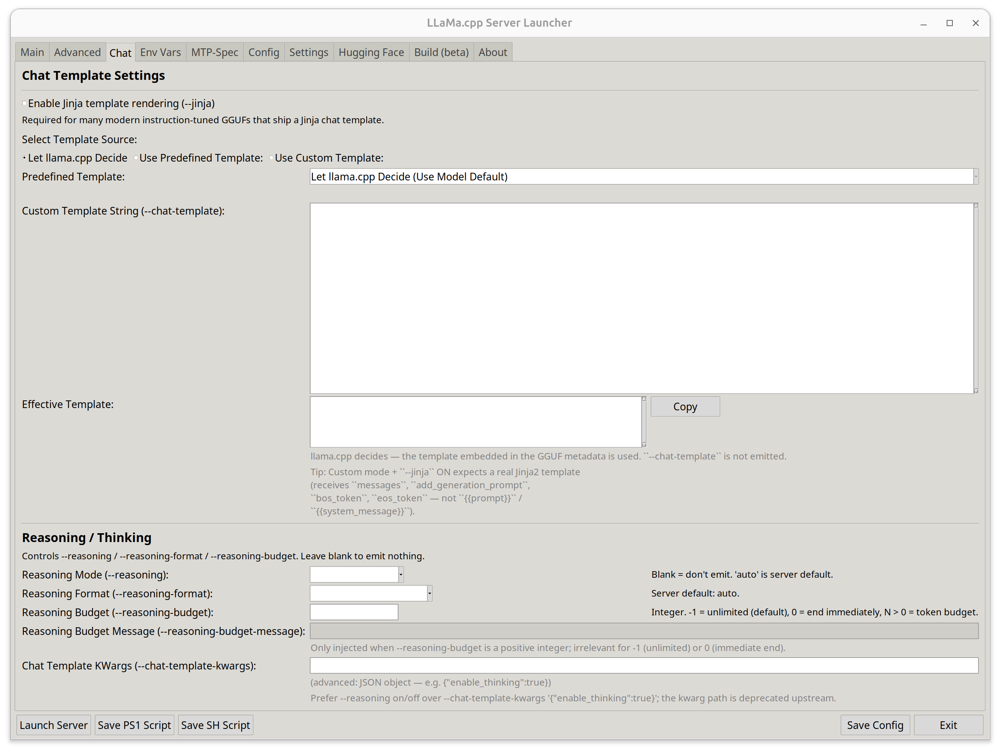
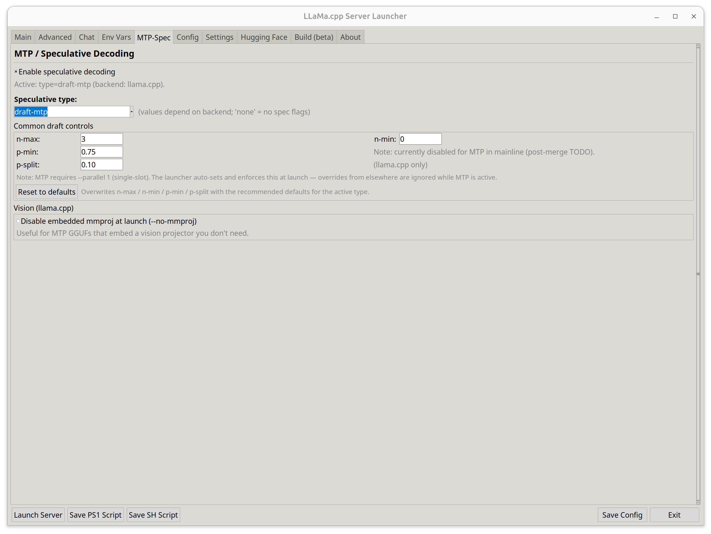
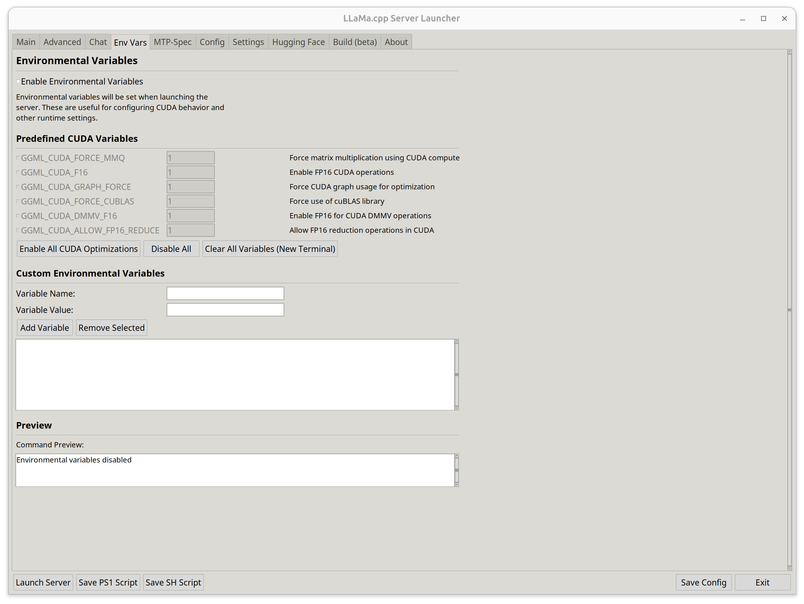
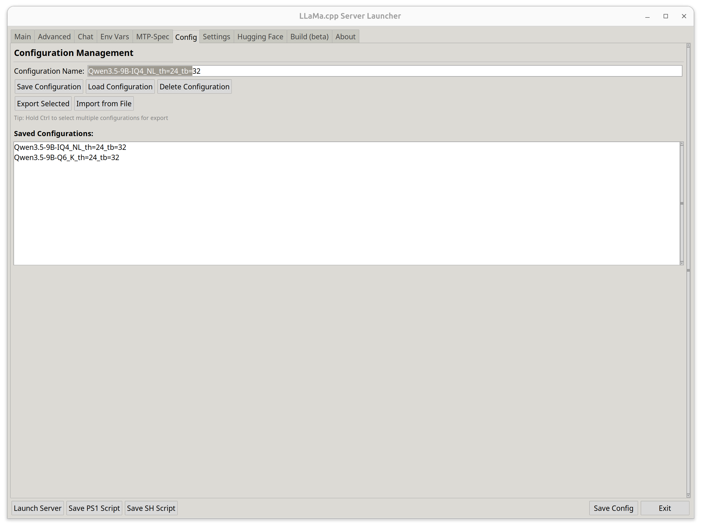

# Llama.cpp (and ik_llama) Server Launcher



**A user-friendly GUI (Tkinter) to easily configure and launch the `llama.cpp and ik_llama` server, manage model configurations, set environment variables, and generate launch scripts.**

This python script provides a comprehensive graphical interface for `llama.cpp and ik_llama`'s server, simplifying the managing of command-line arguments and models.

## ✨ Key Features

*   **Intuitive GUI:** Easy-to-use Tkinter interface with tabbed sections for:
    *   Main Settings (paths, model selection, basic parameters)
    *   Advanced Settings (GPU, memory, cache, performance, generation)
    *   Chat Template (select predefined, use model default, custom Jinja, plus reasoning / thinking controls)
    *   Environment Variables (manage CUDA and custom variables)
    *   MTP / Speculative Decoding (draft model picker, cross-backend draft controls)
    *   Configurations (save/load/import/export launch setups)
    *   Settings (theme, fonts, Windows high-DPI scaling)

<details>
<summary><h3>📸 View Advanced Settings Screenshot</h3></summary>



</details>

*   **Comprehensive Parameter Control:** Fine-tune your `llama.cpp` server:
    *   **Model Management:** Scan directories for GGUF models, automatic model analysis (layers, architecture, size) with fallbacks, manual model info entry.
    *   **Vision/mmproj Handling:** Automatic `mmproj` detection, with an `mmproj` dropdown shown when multiple projector files are found for the selected model.
    *   **Core Parameters:** Threads (main & batch), context size, batch sizes (prompt & ubatch), sampling (temperature, min_p, seed).
    *   **GPU Offloading:** GPU layers (with override), tensor split (with VRAM-based recommendations), user-orderable GPU list, main GPU selection, Flash Attention toggle.
    *   **MoE Offload:** `--cpu-moe` / `--n-cpu-moe` controls for offloading expert layers to CPU on both backends.
    *   **Context Fit:** `--fit` (auto-size context to available VRAM) and `--parallel` slot configuration.
    *   **Memory & Cache:** KV cache types (K & V, including Q6_K), mmap, mlock, no KV offload.
    *   **Network:** Host IP and port configuration.
    *   **Generation:** Ignore EOS, n_predict (max tokens).
    *   **Custom Arguments:** Pass any additional `llama.cpp` server parameters.
    *   **ik_llama Support:** Dedicated parameters tab for ik_llama-specific options.
    <details>
    <summary><h3>📸 View ik_llama Screenshot</h3></summary>

    

    </details>

*   **System & GPU Insights:**
    *   Detects and displays CUDA GPU(s) (via PyTorch), system RAM, and CPU core information.
    *   Supports manual GPU configuration if automatic detection is unavailable.

<details>
<summary><h3>📸 View Chat Templates Screenshot</h3></summary>



</details>


*   **Chat Template Flexibility:**
    *   Load predefined chat templates from `config/chat_templates.json`.
    *   Option to let `llama.cpp` decide the template based on model metadata.
    *   Provide your own custom Jinja2 template string.
    *   `--jinja` toggle for Jinja template rendering (required by many modern instruction-tuned GGUFs).
    *   **Reasoning / Thinking controls:** `--reasoning` (on / off / auto), `--reasoning-format` (none / deepseek / deepseek-legacy / auto), `--reasoning-budget`, `--reasoning-budget-message`, and advanced `--chat-template-kwargs` passthrough.

<details>
<summary><h3>📸 View MTP / Speculative Decoding Screenshot</h3></summary>



</details>

*   **MTP / Speculative Decoding:**
    *   Enable speculative decoding with cross-backend support (llama.cpp and ik_llama).
    *   Speculative type selector (e.g., `draft-simple`, `draft-mtp`) with sensible default prefill per type.
    *   Common draft controls: `n-max`, `n-min`, `p-min`, `p-split`, plus a one-click **Reset to defaults**.
    *   Draft model GGUF picker with smart draft GPU controls (`-ngld`, per-device `-devd` selection, draft K/V cache types, `--spec-draft-cpu-moe` / `n-cpu-moe`).
    *   MTP enforces `--parallel 1` automatically; optional `--no-mmproj` for MTP GGUFs that embed an unused vision projector.

<details>
<summary><h3>📸 View Environment Variables Screenshot</h3></summary>



</details>

*   **Environment Variable Management:**
    *   Easily enable/disable common CUDA environment variables (e.g., `GGML_CUDA_FORCE_MMQ`).
    *   Add and manage custom environment variables to fine tune CUDA performance.

<details>
<summary><h3>📸 View Configuration Management Screenshot</h3></summary>



</details>

*   **Configuration Hub:**
    *   Save, load, and delete named launch configurations.
    *   Import and export configurations to JSON for sharing or backup.
    *   Application settings (last used paths, UI preferences) are remembered.
*   **Script Generation:**
    *   Generate ready-to-use PowerShell (`.ps1`) and Bash (`.sh`) scripts from your current settings (including environment variables).
*   **Cross-Platform Design:**
    *   Works on Windows (tested), Linux (tested), and macOS (untested).
    *   Includes platform-specific considerations for venv activation (for GPU recognition) and terminal launching.
*   **Dependency Awareness:**
    *   Checks for optional but recommended dependencies for GPU detection and model information

## 🆕 Recent Features

*   **May 2026** — MTP / Speculative Decoding tab with full cross-backend support: draft GGUF picker, spec-type-aware default prefill, smart draft GPU controls, and auto `--parallel 1` for MTP. Reasoning / Thinking controls added to the Chat Template tab (`--reasoning`, `--reasoning-format`, `--reasoning-budget`, `--chat-template-kwargs`) plus a `--jinja` toggle.
*   **April 2026** — Settings tab (theme/font controls, Windows high-DPI); user-orderable GPU list and `mmproj` selector dropdown; modular project layout (`modules/`, `config/`, `launchers/`); automated test suite + CI workflow.
*   **January 2026** — `--fit` (auto-fit context to VRAM) and `--parallel` slot options; improved GGUF parser.
*   **December 2025** — GPU layer override; Flash Attention updated for newest llama.cpp API; `--cpu-moe` works with ik_llama.
*   **August 2025** — MoE offload options (`--cpu-moe`, llama.cpp PR 15077); `mmproj` command-line wiring; checkbox to toggle `mmproj` scanning for faster directory loads.
*   **July 2025** — Q6_K KV cache option; model search box and configuration name/handling improvements.
*   **June 2025** — ik_llama backend with dedicated parameters tab.

## 📋 Dependencies

### Required
*   **Python 3.10+** with tkinter support (typically included with Python). CI tests on 3.10 / 3.11 / 3.12.
*   **llama.cpp** or **ik_llama** built with server support (`llama-server` executable from either backend)
*   **requests** - Required for version checking and updates
    *   Install with: `pip install requests`

### Optional (Recommended)
*   **PyTorch** (`torch`) - **Required if you want automatic GPU detection and selection**
    *   Install in your virtual environment: `pip install torch`
    *   Without PyTorch, you can still manually configure GPU settings
    *   Enables automatic CUDA device detection and system resource information
*   **psutil** - **Optional for enhanced system information**
    *   Provides detailed CPU and RAM information across platforms
    *   Install with: `pip install psutil`

### Installation Example
```bash
# Create and activate virtual environment
python -m venv venv
source venv/bin/activate  # On Windows: venv\Scripts\activate

# Option 1: Install using requirements.txt (recommended)
pip install -r requirements.txt

# Option 2: Install dependencies individually
pip install requests torch psutil
```

## 🛠️ Installation & Setup

### 1. Clone the Launcher
```bash
git clone https://github.com/thad0ctor/llama-server-launcher.git
cd llama-server-launcher
```

### 2. Setup Dependencies
Install the required Python dependencies using the provided requirements.txt file:
```bash
pip install -r requirements.txt
```
Or follow the [Dependencies](#-dependencies) section above to install dependencies individually.

### 3. Build llama.cpp with CUDA Support

You'll need to build `llama.cpp or ik_llama` separately and point the launcher to the build directory. Here's an example build configuration:

> **⚠️ Example Environment Disclaimer:**  
> The following build example was tested on **Ubuntu 24.04** with **CUDA 12.9** and **GCC 13**. Your build flags may need adjustment based on your system configuration, CUDA version, GCC version, and GPU architecture.

```bash
# Navigate to your llama.cpp (or ik_llama) directory
cd /path/to/llama.cpp

# Clean previous builds
rm -rf build CMakeCache.txt CMakeFiles
mkdir build && cd build

# Configure with CUDA support and optimization flags
CC=/usr/bin/gcc-13 CXX=/usr/bin/g++-13 cmake .. \
  -DGGML_CUDA=on \
  -DGGML_CUDA_FORCE_MMQ=on \
  -DCMAKE_CUDA_ARCHITECTURES=120 \
  -DCMAKE_CUDA_COMPILER=/usr/local/cuda/bin/nvcc \
  -DCMAKE_CUDA_FLAGS="--use_fast_math"

# Build with all available cores
make -j$(nproc)
```

> **📚 Need More Build Help?**  
> For additional building guidance, platform-specific instructions, and troubleshooting, refer to the official [llama.cpp documentation](https://github.com/ggml-org/llama.cpp/blob/master/docs/build.md).

**Key Build Flags Explained:**
- `-DGGML_CUDA=on` - Enables CUDA support
- `-DGGML_CUDA_FORCE_MMQ=on` - Forces use of multi-matrix quantization for better performance
- `-DCMAKE_CUDA_ARCHITECTURES=120` - Targets specific GPU architecture (adjust for your GPU)
- `-DCMAKE_CUDA_FLAGS="--use_fast_math"` - Enables fast math optimizations

### 4. Configure the Launcher
1. Run the launcher: `python llamacpp-server-launcher.py`
2. In the **Main** tab, set the **"LLaMa.cpp Root Directory"** (or **"ik_llama Root Directory"** when the ik_llama backend is selected) to your build folder
3. The launcher will automatically find the `llama-server` executable

&nbsp;

## 🚀 Core Components

This launcher aims to streamline your `llama.cpp` server workflow when working with and testing multiple models while making it more accessible and efficient for both new and experienced users.
